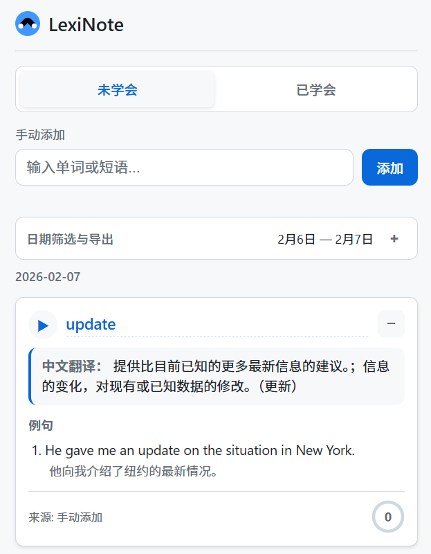
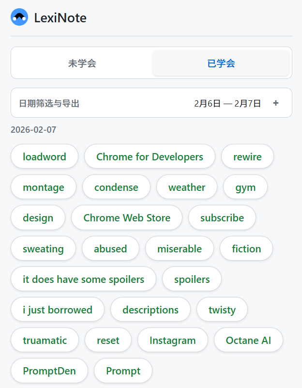
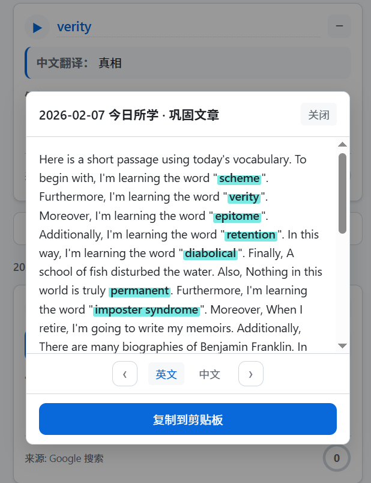

# LexiNote – A Simple Chrome Extension for English Learning

LexiNote is a lightweight Chrome extension designed to help English learners collect, review, and memorize new words and phrases encountered during daily browsing.

It automatically records words from Google Translate and allows manual input, then organizes them into daily learning lists with examples and simple explanations.

---

## Features

### 1. Automatic Word Collection

LexiNote can automatically capture words or phrases from:

- **Google Translate** – When you input text and get a translation, the source word or sentence is automatically saved.
- **Manual Input** – You can also add any word or phrase directly through the extension popup.

---

### 2. Organized Learning Cards

- Each saved word or phrase becomes an independent learning card.
- Cards include:
  - The original word/phrase  
  - Up to 3 example sentences (B2 level)
  - A simple English explanation (B1 level)

If no example is available, the extension will display:  
*“No example available.”*

---

### 3. Simple Definitions for B1 Level

When you hover over a saved word, LexiNote shows a short and easy-to-understand English definition, suitable for intermediate learners.

---

### 4. Daily Organization

- Words are grouped by the date they were added.
- You can filter and review words from:
  - Today  
  - Any specific day  
  - All dates

---

### 5. Progress Tracking

Each word card includes a checkbox system:

- Mark a word as “mastered” after reviewing it.
- Once checked **3 times**, the word is considered fully learned.

---

## Screenshots

### Main Interface

### Learned Words View

### Example Article & Definition

---

## Installation (Developer Mode)

Since this extension is not yet published in the Chrome Web Store, you can install it manually:

1. Download or clone this repository.
2. Open Chrome and go to:
chrome://extensions/

3. Enable **Developer Mode** (top-right corner).
4. Click **Load unpacked**.
5. Select the `src` folder inside this project.

The extension will now appear in your Chrome toolbar.

---

## Project Structure
LexiNote/
├── screenshots/ # Preview images
├── src/ # Source code of the extension
├── LICENSE # Open-source license
└── README.md # Project documentation

---

## Technology

- JavaScript  
- Chrome Extensions API  
- Free Dictionary API (for examples and definitions)

---

## License

This project is open source and released under the MIT License.

---

## Future Plans

- Add pronunciation support  
- Export word lists  
- Dark mode  
- Support for more websites

---

## Author

Created by **afu-botstar**

Feel free to contribute or report issues!

# LexiNote - 英语学习 Chrome 扩展

记录你在 Google 翻译、豆包网页和手动输入的单词/短语，按日期展示，配合 B1 释义与 B2 例句，并通过「勾选 3 次」标记掌握。

## 功能

1. **记录来源**
   - **Google 翻译**：在 [translate.google.com](https://translate.google.com) 输入并得到翻译后，自动记录源文本（单词或句子）。
   - **豆包网页**：在豆包网页版输入并发送后，自动记录（桌面版豆包无法注入，请用 popup 里的「手动添加」）。
   - **手动添加**：在扩展 popup 里输入单词或短语后点击「添加」。

2. **每个词一个模块（列表形式）**
   - 每个单词/短语单独一个卡片。
   - 每个模块包含：**单词/短语** + **最多 3 条 B2 水平例句**（来自 [Free Dictionary API](https://dictionaryapi.dev/) 的例句，不足时显示「暂无例句」）。

3. **B1 英文释义**
   - 鼠标悬停在单词/短语上，会显示简短的英文释义（同上 API，适合 B1 水平阅读）。

4. **按日期展示**
   - 上方有「按日期」下拉框，可选「全部日期」或某一天。
   - 列表按日期分组，每天下列出当天记录/学习的词。

5. **勾选 3 次即掌握**
   - 每个词右侧有一个勾选按钮（○ / ✓）。
   - 点击 1 次：○ → ✓（第 1 次）。
   - 点击 2 次：✓（第 2 次）。
   - 点击 3 次：✓（第 3 次），词会显示为「已掌握」（绿色 + 删除线），按钮变为满勾。

## 安装（开发者模式）

1. 打开 Chrome，地址栏输入：`chrome://extensions/`
2. 右上角打开「开发者模式」。
3. 点击「加载已解压的扩展程序」。
4. 选择本项目的根目录（即包含 `manifest.json` 的 `wordmaster` 文件夹）。

## 使用

- 点击浏览器工具栏里的扩展图标，打开 popup。
- 在 Google 翻译或豆包网页正常查词/翻译，扩展会在有翻译结果时自动记录源文本。
- 豆包桌面版查的词，在 popup 里用「手动添加」输入并添加。
- 在 popup 中按日期筛选、查看模块列表、悬停看释义、点击勾选直到 3 次标记掌握。

